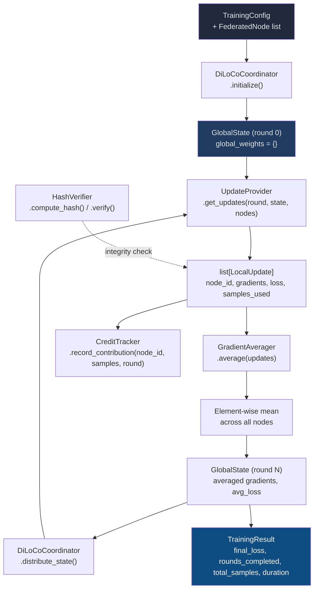

# aumai-fedtrain

**Generic federated training using the DiLoCo protocol. Train models across distributed nodes without sharing raw data.**

[](https://github.com/aumai/aumai-fedtrain/actions)
[](https://pypi.org/project/aumai-fedtrain/)
[](LICENSE)
[](https://python.org)

> **Scope note (SR-7):** This is a scope-reduced implementation. It provides standard gradient averaging (DiLoCo protocol) and SHA-256 hash verification of gradient payloads. Trust-weighted aggregation is explicitly excluded from this package.

---

## What is this?

Imagine you want to train a language model, but your training data is spread across five hospitals. Each hospital has data it legally cannot share with the others. Under traditional centralised training, you would need to move all the data to one place — which is impossible here due to privacy regulations.

Federated learning solves this by reversing the flow: instead of moving data to the model, you move the model to the data. Each hospital trains locally on its own data and sends back only the gradient updates — the mathematical "direction of improvement" — not the data itself. A central coordinator aggregates those gradients and distributes the improved model back to everyone.

`aumai-fedtrain` implements the **DiLoCo** (Distributed Low-Communication) variant of this protocol. DiLoCo reduces communication overhead by having each node perform many local gradient steps before sending updates to the coordinator — making it practical over slower network connections and across geographically distributed nodes.

This library provides the coordinator logic, data structures, gradient averaging, hash verification, and a simulation harness for testing federated training pipelines without needing real distributed infrastructure.

---

## Why does this matter?

Privacy-preserving machine learning is not a niche concern. Healthcare, finance, telecommunications, and any domain with user data faces the same fundamental tension: the best models are trained on the most data, but collecting all that data in one place is often illegal, impractical, or ethically unacceptable.

Federated learning makes it possible to have both — a well-trained model and distributed data. DiLoCo in particular addresses the communication bottleneck that makes naive federated learning impractical at scale.

`aumai-fedtrain` gives you the plumbing for a DiLoCo coordinator in pure Python, with clean abstractions so you can plug in real node communication, custom gradient transformations, or ML framework-specific training loops.

---

## Architecture



---

## How DiLoCo Works

In a standard federated learning round:

1. **Each node receives the current global weights** from the coordinator.
2. **Each node trains locally** for `local_steps` gradient steps on its private data.
3. **Each node sends its gradient update** (the delta from local training) to the coordinator.
4. **The coordinator averages** all gradient updates element-wise.
5. **The averaged gradient becomes the new global state**, which is distributed back.
6. Repeat for `global_rounds` rounds.

DiLoCo's key insight is step 2: by doing many local steps before communicating, each node makes substantial progress locally, dramatically reducing the number of costly network round-trips. The trade-off is slightly noisier gradient aggregation — which is acceptable in practice for most workloads.

---

## Features

- **DiLoCo coordinator** — orchestrates the full training loop: initialize, collect updates, aggregate, distribute.
- **Simple gradient averaging** — element-wise mean across all participating nodes (no trust weighting in this scope-reduced package).
- **SHA-256 hash verification** — deterministic hash of gradient payloads for integrity checking.
- **Cumulative credit tracking** — tracks how many samples each node has contributed across all rounds.
- **`UpdateProvider` protocol** — injectable abstraction for custom node behaviour; swap in real or simulated nodes without changing coordinator code.
- **Built-in simulation** — the CLI includes a simulated `UpdateProvider` with realistic decaying loss for demos and testing.
- **Pydantic v2 models** — all data structures are fully typed, validated, and JSON-serialisable.
- **Zero ML framework dependency** — works with PyTorch, JAX, NumPy, or anything that can produce a `dict[str, list[float]]` gradient dictionary.

---

## Quick Start

### Installation

```bash
pip install aumai-fedtrain
```

### Python API — run a training simulation

```python
from aumai_fedtrain import (
    DiLoCoCoordinator,
    FederatedNode,
    TrainingConfig,
    UpdateProvider,
    LocalUpdate,
    GlobalState,
)
import random
import math


class SimulatedProvider(UpdateProvider):
    """Simple simulated update provider with decaying loss."""

    def get_updates(
        self,
        round_id: int,
        state: GlobalState,
        nodes: list[FederatedNode],
    ) -> list[LocalUpdate]:
        updates = []
        for node in nodes:
            gradients = {
                "weight": [random.gauss(0, 0.1 / round_id) for _ in range(4)],
                "bias":   [random.gauss(0, 0.1 / round_id) for _ in range(1)],
            }
            loss = math.exp(-round_id * 0.2) + random.uniform(0.0, 0.02)
            updates.append(LocalUpdate(
                node_id=node.node_id,
                round_id=round_id,
                gradients=gradients,
                loss=round(loss, 6),
                samples_used=random.randint(64, 256),
            ))
        return updates


# Set up training
config = TrainingConfig(
    model_name="my-model-v1",
    learning_rate=0.001,
    batch_size=32,
    local_steps=10,
    global_rounds=5,
    num_nodes=3,
)

nodes = [
    FederatedNode(node_id=f"node-{i}", address=f"10.0.0.{i}:5000")
    for i in range(3)
]

coordinator = DiLoCoCoordinator()
result = coordinator.run_training(config, nodes, SimulatedProvider())

print(f"Rounds completed: {result.rounds_completed}")
print(f"Final loss:       {result.final_loss:.6f}")
print(f"Total samples:    {result.total_samples}")
print(f"Duration:         {result.duration_seconds:.3f}s")

# Check per-node credits
for node_id, samples in coordinator.credit_tracker.all_credits().items():
    print(f"  {node_id}: {samples} samples processed")
```

### Python API — verify gradient integrity

```python
from aumai_fedtrain import HashVerifier, LocalUpdate

verifier = HashVerifier()

update = LocalUpdate(
    node_id="node-0",
    round_id=1,
    gradients={"weight": [0.1, -0.2, 0.05], "bias": [0.01]},
    loss=0.342,
    samples_used=128,
)

# Compute and store the hash when receiving an update
digest = verifier.compute_hash(update.gradients)
print(f"Gradient hash: {digest}")

# Later — verify the update has not been tampered with
is_valid = verifier.verify(update, digest)
print(f"Integrity check: {'PASSED' if is_valid else 'FAILED'}")
```

---

## CLI Reference

### `aumai-fedtrain init`

Initialise a federated training session and create simulated nodes.

```bash
aumai-fedtrain init --config train.json --nodes 4
```

**Options:**

| Flag | Required | Default | Description |
|---|---|---|---|
| `--config PATH` | Yes | — | Path to training config JSON. |
| `--nodes INT` | No | `4` | Number of simulated nodes to create. |

**Config JSON format:**

```json
{
  "model_name": "my-model-v1",
  "learning_rate": 0.001,
  "batch_size": 32,
  "local_steps": 10,
  "global_rounds": 20,
  "num_nodes": 4
}
```

---

### `aumai-fedtrain run`

Run a full federated training simulation from end to end.

```bash
aumai-fedtrain run --config train.json
aumai-fedtrain run --config train.json --nodes 8 --param-names "layer1,layer2,output" --param-size 16
```

**Options:**

| Flag | Required | Default | Description |
|---|---|---|---|
| `--config PATH` | Yes | — | Path to training config JSON. |
| `--nodes INT` | No | `4` | Number of simulated nodes. |
| `--param-names TEXT` | No | `"weight,bias"` | Comma-separated list of parameter names for simulation. |
| `--param-size INT` | No | `8` | Vector length per parameter for the simulation. |

**Sample output:**

```
Starting federated training: my-model-v1  nodes=4  rounds=10

Training complete.
  Rounds completed:  10/10
  Total samples:     8420
  Final avg loss:    0.051234
  Duration:          0.003s

Node credits (samples processed):
  node-000: 2145 samples
  node-001: 2063 samples
  node-002: 2198 samples
  node-003: 2014 samples
```

---

### `aumai-fedtrain status`

Show status for a given round (uses in-memory session state from `init`).

```bash
aumai-fedtrain status --round-id 5
```

**Options:**

| Flag | Required | Description |
|---|---|---|
| `--round-id INT` | Yes | Round ID to query. |
| `--config PATH` | No | Optional training config to show context. |

---

### `aumai-fedtrain verify`

Verify the integrity of a `LocalUpdate`'s gradient payload against an expected SHA-256 hash.

```bash
aumai-fedtrain verify --update update.json --hash <sha256hex>
```

**Options:**

| Flag | Required | Description |
|---|---|---|
| `--update PATH` | Yes | Path to a `LocalUpdate` JSON file. |
| `--hash TEXT` | Yes | Expected SHA-256 hex digest. |

**Exits with code 1 if verification fails.**

---

## Configuration Reference

All training configuration is expressed as a `TrainingConfig` Pydantic model:

| Field | Type | Constraint | Description |
|---|---|---|---|
| `model_name` | `str` | Required | Identifier for the model being trained. |
| `learning_rate` | `float` | `> 0.0` | Learning rate for local optimisation. |
| `batch_size` | `int` | `> 0` | Batch size for local training steps. |
| `local_steps` | `int` | `> 0` | Number of local gradient steps per global round. |
| `global_rounds` | `int` | `> 0` | Total number of global aggregation rounds. |
| `num_nodes` | `int` | `> 0` | Expected number of participating nodes. |

---

## Implementing a Real `UpdateProvider`

`UpdateProvider` is the injection point for real node behaviour. Subclass it and implement `get_updates`:

```python
from aumai_fedtrain import UpdateProvider, LocalUpdate, GlobalState, FederatedNode
import httpx  # or your preferred HTTP client

class HttpUpdateProvider(UpdateProvider):
    """Fetches real gradient updates from live nodes over HTTP."""

    def get_updates(
        self,
        round_id: int,
        state: GlobalState,
        nodes: list[FederatedNode],
    ) -> list[LocalUpdate]:
        updates = []
        for node in nodes:
            response = httpx.post(
                f"http://{node.address}/train",
                json={
                    "round_id": round_id,
                    "global_weights": state.global_weights,
                },
                timeout=30.0,
            )
            response.raise_for_status()
            updates.append(LocalUpdate.model_validate(response.json()))
        return updates
```

The coordinator calls `update_provider.get_updates(round_id, state, nodes)` once per round and expects a `list[LocalUpdate]` in return. The rest of the training loop is handled automatically.

---

## Scope Boundaries (SR-7)

This package deliberately excludes:

- **Trust-weighted gradient aggregation** — all nodes receive equal weight in averaging. If you need differential weighting based on node reliability, data quality, or contribution history, that is outside the scope of this package.

This boundary exists to keep the package focused, auditable, and free of the IP concerns associated with trust scoring algorithms.

---

## Integration with Other AumAI Projects

| Project | Integration point |
|---|---|
| **aumai-contributorecono** | Award `code` contributions for each node that completes a training round; use `samples_used` from `LocalUpdate` to set the points multiplier. |
| **aumai-ossustain** | Monitor `dependency_freshness` and `test_coverage` of federated training infrastructure repos as part of sustainability scoring. |
| **aumai-specs** | Use `TrainingConfig` as a spec-validated input for training job descriptions. |

---

## Contributing

Contributions are welcome. Please read `CONTRIBUTING.md` and note the SR-7 scope boundaries before proposing new features.

```bash
git clone https://github.com/aumai/aumai-fedtrain
cd aumai-fedtrain
pip install -e ".[dev]"
make test
```

---

## License

Apache License 2.0. See [LICENSE](LICENSE) for full text.

Copyright 2025 AumAI Contributors.

---

## Part of AumAI

This project is part of [AumAI](https://github.com/aumai) — open-source infrastructure for the agentic AI era.
